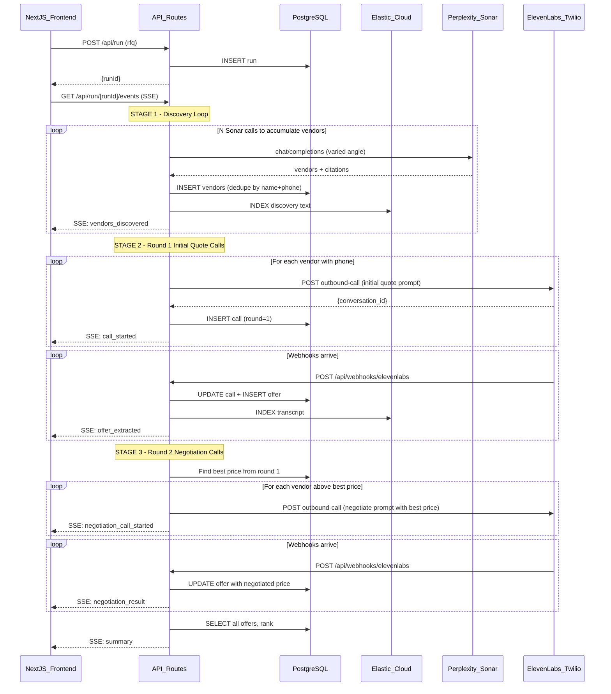

# Procurement Agent: Real Backend Plan

## Current State

The app has a polished Next.js frontend ([`src/app/page.js`](src/app/page.js)) with a chat intake, live activity feed, voice call panel, quotes panel, and summary panel. All backend behavior is faked via `setTimeout` chains in [`src/lib/agent-store.js`](src/lib/agent-store.js). No API routes, no database, no external integrations exist yet.

The frontend already defines clean data shapes via its callback pattern:

- `activities`: `{id, type, title, description, timestamp, status, tool, parallelGroup}`
- `quotes`: `{supplier, unitPrice, moq, leadTime, shipping, terms, confidence, source}`
- `calls`: `{id, active, supplier, duration, status, subActions?}`
- `summary`: `{suppliersFound, quotesReceived, bestPrice, bestSupplier, avgLeadTime, recommendation, savings, nextSteps}`

The plan preserves all existing components unchanged and replaces only the data source.

---

## Architecture



---

## Folder Structure (MVP -- no extras)

```
src/
  app/
    page.js                              # MODIFY: replace simulateWorkflow with SSE
    layout.js                            # unchanged
    api/
      setup/route.ts                     # one-time: create ES indices
      run/route.ts                       # POST: create run, kick off orchestrator
      run/[runId]/events/route.ts        # GET: SSE stream
      webhooks/elevenlabs/route.ts       # POST: post-call transcript
  lib/
    db.ts                                # Prisma singleton
    elastic.ts                           # ES client + index/query helpers
    perplexity.ts                        # Sonar API: discoverVendors()
    elevenlabs.ts                        # outbound call trigger
    orchestrator.ts                      # workflow engine (core)
    events.ts                            # in-memory EventEmitter hub for SSE
  prisma/
    schema.prisma                        # PG schema (4 models, no Event)
  components/                            # ALL UNCHANGED
```

**What is cut:**

- No Zod, no types file, no validation -- plain objects everywhere
- No Event model in PG -- events are fire-and-forget via in-memory EventEmitter
- No HMAC signature verification on webhooks
- No SSE catch-up replay -- live stream only
- No Stagehand/Browserbase -- Sonar handles discovery
- No Visa/Coinbase payments -- mock the payment stage
- No multi-user tenancy -- single user for hackathon

---

## 1. Dependencies to Install

```bash
npm install @prisma/client @elastic/elasticsearch
npm install -D prisma
```

That's it. No Zod, no validation libraries. Perplexity Sonar and ElevenLabs are plain `fetch()` calls -- no SDKs. Plain objects everywhere.

---

## 2. PostgreSQL Schema (Prisma)

File: `prisma/schema.prisma`

```prisma
datasource db {
  provider = "postgresql"
  url      = env("DATABASE_URL")
}

generator client {
  provider = "prisma-client-js"
}

model Run {
  id         String   @id @default(cuid())
  rawQuery   String
  parsedSpec Json     // {item, quantity, leadTime, quality, location}
  status     String   @default("pending")
  createdAt  DateTime @default(now())
  updatedAt  DateTime @updatedAt
  vendors    Vendor[]
}

model Vendor {
  id        String   @id @default(cuid())
  runId     String
  run       Run      @relation(fields: [runId], references: [id])
  name      String
  url       String?
  phone     String?
  email     String?
  source    String   // "sonar"
  sourceUrl String?  // citation URL from Sonar
  metadata  Json?
  createdAt DateTime @default(now())
  offers    Offer[]
  calls     Call[]
}

model Offer {
  id           String   @id @default(cuid())
  vendorId     String
  vendor       Vendor   @relation(fields: [vendorId], references: [id])
  unitPrice    Float?
  moq          String?
  leadTimeDays Int?
  shipping     String?
  terms        String?
  confidence   Int?
  source       String   // "voice-call"
  rawEvidence  String?  // transcript excerpt
  createdAt    DateTime @default(now())
}

model Call {
  id             String   @id @default(cuid())
  vendorId       String
  vendor         Vendor   @relation(fields: [vendorId], references: [id])
  runId          String   // denormalized for quick lookup in webhook
  round          Int      @default(1) // 1 = initial quote, 2 = negotiation
  conversationId String?  @unique // ElevenLabs conversation_id
  transcript     String?
  status         String   @default("pending")
  duration       Int?
  createdAt      DateTime @default(now())
}
```

No `Event` model -- events are fire-and-forget via the in-memory EventEmitter. No persistence needed for a demo.

Key design choice: `Call.runId` is denormalized so the ElevenLabs webhook can look up the run directly from `conversationId` without joining through Vendor.

---

## 3. Elasticsearch Index (semantic_text)

File: `src/lib/elastic.ts`

Use a **single index** `proc_memory` with the `semantic_text` field type. This is the critical simplification -- `semantic_text` auto-chunks long text and auto-generates embeddings inside Elastic Cloud serverless. No BYO embeddings, no ingest pipelines, no extra API calls.

```typescript
import { Client } from '@elastic/elasticsearch';

const client = new Client({
  node: process.env.ELASTIC_URL,
  auth: { apiKey: process.env.ELASTIC_API_KEY },
  serverMode: 'serverless',
});

// Called once via /api/setup
async function createIndex() {
  await client.indices.create({
    index: 'proc_memory',
    mappings: {
      properties: {
        text:       { type: 'semantic_text' },
        run_id:     { type: 'keyword' },
        vendor_id:  { type: 'keyword' },
        channel:    { type: 'keyword' },  // "search" | "call" | "note"
        created_at: { type: 'date' },
      }
    }
  });
}

// Write a memory document
async function writeMemory(doc) {
  await client.index({
    index: 'proc_memory',
    document: doc,
    timeout: '5m',  // semantic_text may need model warmup
  });
}

// Retrieve relevant memories
async function retrieveMemory(query, filters = {}) {
  const must = [];
  if (filters.vendor_id) must.push({ term: { vendor_id: filters.vendor_id } });
  if (filters.run_id)    must.push({ term: { run_id: filters.run_id } });

  return client.search({
    index: 'proc_memory',
    body: {
      retriever: {
        standard: {
          query: {
            bool: {
              must: [
                { semantic: { field: 'text', query } },
                ...must,
              ]
            }
          }
        }
      },
      size: 5,
    }
  });
}
```

**Potential issue addressed:** First `writeMemory` call after deploy may be slow (~30-60s) as Elastic loads the embedding model. The `timeout: '5m'` handles this. Subsequent writes are fast.

---

## 4. Perplexity Sonar Client (Multi-Conversation Discovery Loop)

File: `src/lib/perplexity.ts`

Plain `fetch()`. Use `response_format: { type: "json_object" }` to get JSON back (simpler than json_schema, no schema needed). Citations come as a top-level `citations` array on the response object (NOT inside `choices`).

The discovery loop calls Sonar **multiple times** with varied angles to accumulate vendors. Results deduped by name before inserting into Postgres.

````typescript
// Placeholder prompts -- fill in later
const DISCOVERY_SYSTEM_PROMPT = '';  // TODO
const DISCOVERY_ANGLES = ['', '', ''];  // TODO

async function discoverVendors(spec, angle = '') {
  const res = await fetch('https://api.perplexity.ai/chat/completions', {
    method: 'POST',
    headers: {
      'Authorization': `Bearer ${process.env.PERPLEXITY_API_KEY}`,
      'Content-Type': 'application/json',
    },
    body: JSON.stringify({
      model: 'sonar-pro',
      messages: [
        { role: 'system', content: DISCOVERY_SYSTEM_PROMPT },
        { role: 'user', content: `${angle} ${spec.item} ${spec.quantity}` },
      ],
    }),
  });
  const data = await res.json();
  // Best-effort parse -- content might be JSON or text with JSON in it
  let vendors = [];
  try {
    const raw = data.choices[0].message.content;
    vendors = JSON.parse(raw.replace(/```json?\n?/g, '').replace(/```/g, ''));
  } catch { vendors = []; }
  const citations = data.citations ?? [];
  return { vendors, citations };
}

// Runs the loop -- called by orchestrator
async function runDiscoveryLoop(spec) {
  const allVendors = [];
  for (const angle of DISCOVERY_ANGLES) {
    const { vendors, citations } = await discoverVendors(spec, angle);
    allVendors.push(...vendors.map((v, i) => ({
      ...v, sourceUrl: citations[i] ?? null,
    })));
  }
  // Simple dedupe by name
  const seen = new Set();
  return allVendors.filter(v => {
    const key = v.name?.toLowerCase();
    if (seen.has(key)) return false;
    seen.add(key);
    return true;
  });
}
````

**Potential issue addressed:** Sonar sometimes wraps JSON in markdown fences. The `replace` strips those. If parsing fails entirely, we just get an empty array and move on -- no crash.

---

## 5. ElevenLabs Voice Client (Two-Round Calling)

File: `src/lib/elevenlabs.ts`

The same `triggerOutboundCall` function handles both rounds. The difference is the `round` field and the `dynamic_variables` passed -- round 2 includes the best competing price for the negotiation prompt. The ElevenLabs agent uses dynamic variables in its prompt template, so the agent's behavior changes based on what we inject.

```typescript
// Placeholder prompts configured in ElevenLabs dashboard
// Round 1 agent: uses {{item}}, {{quantity}}, {{deadline}} to ask for a quote
// Round 2 agent: uses {{item}}, {{bestPrice}}, {{bestSupplier}} to negotiate

async function triggerOutboundCall(vendor, runId, spec, round = 1, negotiationContext = {}) {
  const dynamicVars = {
    runId,
    vendorId: vendor.id,
    vendorName: vendor.name,
    item: spec.item,
    quantity: spec.quantity,
    deadline: spec.leadTime,
    round: String(round),
    // Round 2 negotiation data (empty for round 1)
    bestPrice: negotiationContext.bestPrice ?? '',
    bestSupplier: negotiationContext.bestSupplier ?? '',
    targetPrice: negotiationContext.targetPrice ?? '',
  };

  const res = await fetch(
    'https://api.elevenlabs.io/v1/convai/twilio/outbound-call',
    {
      method: 'POST',
      headers: {
        'xi-api-key': process.env.ELEVENLABS_API_KEY,
        'Content-Type': 'application/json',
      },
      body: JSON.stringify({
        agent_id: round === 1
          ? process.env.ELEVENLABS_AGENT_ID_QUOTE      // agent for initial quoting
          : process.env.ELEVENLABS_AGENT_ID_NEGOTIATE,  // agent for negotiation
        agent_phone_number_id: process.env.ELEVENLABS_PHONE_NUMBER_ID,
        to_number: vendor.phone,
        conversation_initiation_client_data: {
          dynamic_variables: dynamicVars,
        },
      }),
    }
  );
  return res.json(); // contains conversation_id
}
```

**Two separate ElevenLabs agents** (or one agent with round-aware prompt logic via dynamic variables):

- **Quote Agent** (`ELEVENLABS_AGENT_ID_QUOTE`): Placeholder prompt -- asks vendor for price, MOQ, lead time, shipping, payment terms for `{{item}}` x `{{quantity}}`.
- **Negotiate Agent** (`ELEVENLABS_AGENT_ID_NEGOTIATE`): Placeholder prompt -- tells vendor we received `{{bestPrice}}` from another supplier for `{{item}}`, asks if they can match or beat it.

Both agents are configured in the ElevenLabs dashboard with empty/placeholder system prompts. Dynamic variables are injected at call time.

**Potential issue addressed:** The API recently changed from `from_number` to `agent_phone_number_id`. Using the current parameter name. Using separate agent IDs keeps the prompt logic clean -- no need for conditional branching inside one agent.

---

## 6. In-Memory Event Bus for SSE

File: `src/lib/events.ts`

```typescript
import { EventEmitter } from 'events';

// Global singleton survives HMR in dev
const globalForEvents = globalThis as any;
export const eventBus: EventEmitter =
  globalForEvents.__eventBus ?? (globalForEvents.__eventBus = new EventEmitter());
eventBus.setMaxListeners(100);

export function emitRunEvent(runId, event) {
  eventBus.emit(`run:${runId}`, event);
}
```

This is the simplest possible approach for SSE. No Redis, no external pub/sub. Works perfectly for single-instance hackathon deployment.

---

## 7. API Routes

### POST /api/run/route.ts

- Read `req.json()` directly -- no validation
- Creates `Run` in Postgres
- Kicks off orchestrator as `void runOrchestrator(runId)` (fire-and-forget async)
- Returns `{ runId }` immediately

### GET /api/run/[runId]/events/route.ts

- Returns SSE `ReadableStream`
- Subscribes to `eventBus.on("run:{runId}")`
- On client disconnect (`req.signal.abort`), unsubscribes
- Live stream only -- no catch-up replay

### POST /api/webhooks/elevenlabs/route.ts

Critical glue between ElevenLabs and the orchestrator's poll loop. No auth, no HMAC -- just parse and process:

1. Return `NextResponse.json({ ok: true })` (200) **immediately**
2. In a detached async (or `waitUntil`), do the real work:

                                                                                                                                                                                                                                                                                                                                                                                                                                                                                                                                                                                                                                                                                                                                                                                                - Parse body, grab `conversation_id` and transcript
                                                                                                                                                                                                                                                                                                                                                                                                                                                                                                                                                                                                                                                                                                                                                                                                - Look up `Call` by `conversationId` -- gives us `runId`, `vendorId`, `round`
                                                                                                                                                                                                                                                                                                                                                                                                                                                                                                                                                                                                                                                                                                                                                                                                - Store transcript in `Call.transcript`, set `Call.status = "completed"`
                                                                                                                                                                                                                                                                                                                                                                                                                                                                                                                                                                                                                                                                                                                                                                                                - Create a placeholder `Offer` row (just raw transcript, no real extraction yet)
                                                                                                                                                                                                                                                                                                                                                                                                                                                                                                                                                                                                                                                                                                                                                                                                - Index transcript text into ES
                                                                                                                                                                                                                                                                                                                                                                                                                                                                                                                                                                                                                                                                                                                                                                                                - Emit SSE events: `quote`, `calls_change`

**Potential issue addressed:** ElevenLabs auto-disables webhooks after 10 consecutive failures. Handler returns 200 first, all processing after is wrapped in try/catch so it never crashes.

---

## 8. Orchestrator (Core Engine)

File: `src/lib/orchestrator.ts`

This is the heart. A single async function that runs the full two-round procurement workflow, emitting events that the SSE endpoint streams to the UI.

### Core loop logic

```
async function runOrchestrator(runId):

  1. Load run + parsed spec from PG

  -- STAGE: finding_suppliers --
  2. emit serviceChange {perplexity: true, elasticsearch: true}
     emit activity (type: "memory", "Checking past deals in memory")

  3. DISCOVERY LOOP (runs Sonar N times with different angles):
     for each angle in DISCOVERY_ANGLES:
       - Call discoverVendors(spec, angle)
       - emit activity (type: "search", title per angle)
       - Dedupe against existing vendors for this run (by name/phone)
       - INSERT new vendors into PG
       - INDEX discovery text into ES
       - emit activity (type: "search", "Found X new vendors")

     Result: All accumulated vendors in PG with phone numbers

  -- STAGE: calling_for_quote (ROUND 1) --
  4. emit serviceChange {elevenlabs: true}
     vendorsWithPhone = SELECT vendors WHERE runId AND phone IS NOT NULL

  5. ROUND 1 CALL LOOP:
     for each vendor in vendorsWithPhone:
       - triggerOutboundCall(vendor, runId, spec, round=1)
       - INSERT call row (round=1, conversationId from response)
       - emit call_started event
       - emit calls_change (update active calls list for UI)

  6. WAIT FOR ROUND 1 COMPLETION:
     Poll loop (every 3s, max 5min timeout):
       - SELECT calls WHERE runId AND round=1
       - If all calls have status "completed" or "failed" -> break
       - (Webhook handler updates call status + creates offers as they arrive)

     After loop: all round 1 offers are in PG

  -- STAGE: negotiating (ROUND 2) --
  7. emit serviceChange {elevenlabs: true, elasticsearch: true}

  8. NEGOTIATION STRATEGY:
     - Load all round 1 offers from PG
     - Find bestOffer (lowest unitPrice)
     - Find negotiationTargets = vendors whose offer > bestOffer.unitPrice
     - emit activity (type: "analyze", "Best price: $X from VendorY")
     - emit activity (type: "analyze", "Will negotiate with Z vendors")

  9. ROUND 2 CALL LOOP:
     for each vendor in negotiationTargets:
       negotiationContext = {
         bestPrice: bestOffer.unitPrice,
         bestSupplier: bestOffer.vendor.name,  // or "another supplier"
         targetPrice: bestOffer.unitPrice,
       }
       - triggerOutboundCall(vendor, runId, spec, round=2, negotiationContext)
       - INSERT call row (round=2, conversationId)
       - emit negotiation_call_started
       - emit calls_change

  10. WAIT FOR ROUND 2 COMPLETION:
      Same poll loop as step 6 but for round=2 calls.
      Webhook handler creates/updates offers with negotiated prices.

  -- STAGE: paying_deposit --
  11. [MVP: emit mock payment event]

  -- STAGE: complete --
  12. Aggregate ALL offers (round 1 + round 2) from PG
      - Rank by unitPrice, then leadTime, then confidence
      - Build summary object with bestPrice, savings %, recommendation
      - emit summary event
      - UPDATE run.status = "complete"
```

### Webhook handler's role in the loop

The orchestrator does NOT parse transcripts itself. The webhook handler at `/api/webhooks/elevenlabs` does the heavy lifting independently:

1. Receives `post_call_transcription` from ElevenLabs
2. Looks up the `Call` row by `conversationId`
3. Stores transcript in `Call.transcript`
4. Creates placeholder `Offer` row
5. Indexes transcript into ES for future memory retrieval
6. Updates `Call.status` to "completed"
7. Emits SSE events: `quote` (for the quotes panel), `calls_change`

The orchestrator's poll loop in steps 6 and 10 simply waits for the webhook handler to finish setting `Call.status = "completed"` for all calls in that round.

### Key detail: calls_change events for the phone call panel

The UI's `PhoneCallPanel` expects an array of all active + ended calls. Every time a call starts or a webhook arrives, the orchestrator (or webhook handler) emits a `calls_change` event with the **full current array** of calls for the run:

```typescript
// After any call state change:
const allCalls = await prisma.call.findMany({
  where: { runId },
  include: { vendor: true },
  orderBy: { createdAt: 'asc' },
});
emitRunEvent(runId, {
  type: 'calls_change',
  payload: allCalls.map(c => ({
    id: c.id,
    active: c.status === 'ringing' || c.status === 'connected',
    supplier: c.vendor.name,
    duration: c.duration ?? 0,
    status: c.status,
  })),
});
```

The orchestrator emits events using the exact same shapes the frontend already expects (activity, quote, call, summary). This means **zero frontend component changes**.

---

## 9. Frontend Changes (Minimal)

Only [`src/app/page.js`](src/app/page.js) changes. Replace the `simulateWorkflow` import and call with:

```javascript
// Instead of: const cleanup = simulateWorkflow(rfq, callbacks)
// Do:
const response = await fetch('/api/run', {
  method: 'POST',
  body: JSON.stringify(rfq),
});
const { runId } = await response.json();

const eventSource = new EventSource(`/api/run/${runId}/events`);
eventSource.onmessage = (e) => {
  const event = JSON.parse(e.data);
  switch (event.type) {
    case 'stage_change':    callbacks.onStageChange(event.payload.stage); break;
    case 'activity':        callbacks.onActivity(event.payload); break;
    case 'update_activity': callbacks.onUpdateActivity(event.payload.id, event.payload.updates); break;
    case 'quote':           callbacks.onQuote(event.payload); break;
    case 'calls_change':    callbacks.onCallsChange(event.payload); break;
    case 'summary':         callbacks.onSummary(event.payload); break;
    case 'services_change': callbacks.onServicesChange(event.payload); break;
  }
};
// cleanup = () => eventSource.close()
```

All existing components (`ActivityFeed`, `PhoneCallPanel`, `QuotesPanel`, `SummaryPanel`, `RequirementsChat`) remain completely untouched.

---

## 10. Environment Variables

```
DATABASE_URL=postgresql://...
ELASTIC_URL=https://my-elasticsearch-project-d08f4f.es.us-west1.gcp.elastic.cloud:443
ELASTIC_API_KEY=OURrVlhwd0IxSG5XakN4QzNhUnA6WkFTd3lsZHdXTmtEY3hEc0dYeXJFQQ==
PERPLEXITY_API_KEY=pplx-...
ELEVENLABS_API_KEY=...
ELEVENLABS_AGENT_ID_QUOTE=...
ELEVENLABS_AGENT_ID_NEGOTIATE=...
ELEVENLABS_PHONE_NUMBER_ID=...
```

---

## Potential Issues and Mitigations

- **semantic_text slow on first write**: Use `timeout: '5m'` on index calls; model warms up once then stays hot
- **ElevenLabs webhook disabled after failures**: Always return 200 first, process async. Wrap in try/catch.
- **Sonar returns non-JSON**: Strip markdown fences, fall back to empty array
- **SSE disconnects on Vercel/serverless**: Run locally or on Railway/Render for hackathon. Vercel has 30s limit.
- **Prisma connection exhaustion in dev**: Use standard global singleton pattern in `lib/db.ts`
- **Webhook arrives before call row inserted**: INSERT call row synchronously before returning from triggerOutboundCall
- **No phone number for a discovered vendor**: Skip call, emit a "skipped" activity event

---

## Implementation Stages

### Stage 1: Foundation (DB, Event Bus, Elastic)

Everything that other stages depend on. No types file, no Zod, no validation -- plain objects everywhere. After this stage you can write to PG, write/query ES, and emit events.

Files created:

- `prisma/schema.prisma` -- Run, Vendor, Offer, Call (with `round`). No Event model.
- `src/lib/db.ts` -- Prisma singleton
- `src/lib/events.ts` -- EventEmitter hub
- `src/lib/elastic.ts` -- ES client + createIndex/writeMemory/retrieveMemory
- `src/app/api/setup/route.ts` -- one-time index creation + DB check

Test: Run `npx prisma migrate dev`, hit `/api/setup`, confirm index created in Elastic Cloud.

---

### Stage 2: External Service Clients (Sonar, ElevenLabs, Webhook)

Each service client is a standalone file. The webhook handler is here because it is tightly coupled to the ElevenLabs call lifecycle. No HMAC, no auth.

Files created:

- `src/lib/perplexity.ts` -- `discoverVendors(spec, angle)` + `runDiscoveryLoop(spec)`, simple name-based dedupe
- `src/lib/elevenlabs.ts` -- `triggerOutboundCall(vendor, runId, spec, round, negotiationContext)`
- `src/app/api/webhooks/elevenlabs/route.ts` -- return 200, parse body, store transcript, placeholder offer, index ES, emit SSE

Test: Call `discoverVendors()` directly. Trigger a real outbound call. Confirm webhook writes to PG + ES.

---

### Stage 3: Orchestrator + API Routes (Wire It All Together)

The orchestrator calls the Stage 2 clients inside the two-round loop. API routes are thin -- no validation, just `req.json()` and go.

Files created:

- `src/lib/orchestrator.ts` -- `runOrchestrator(runId)` with the full pipeline
- `src/app/api/run/route.ts` -- POST: read body, create run, fire orchestrator
- `src/app/api/run/[runId]/events/route.ts` -- GET: SSE stream (live only, no replay)

Test: `curl -X POST /api/run` with an RFQ, open `/api/run/{id}/events` in browser to see SSE stream.

---

### Stage 4: Frontend Integration (Connect UI to Real Backend)

Replace the simulated workflow with the real SSE connection. All existing components stay untouched -- only `page.js` changes.

Files modified:

- `src/app/page.js` -- replace `simulateWorkflow` with `fetch('/api/run')` + `EventSource`
- `.env.local` -- all API keys and connection strings

Test: Full end-to-end. Enter an RFQ in the chat, watch real discovery, real calls, real quotes, real negotiation.