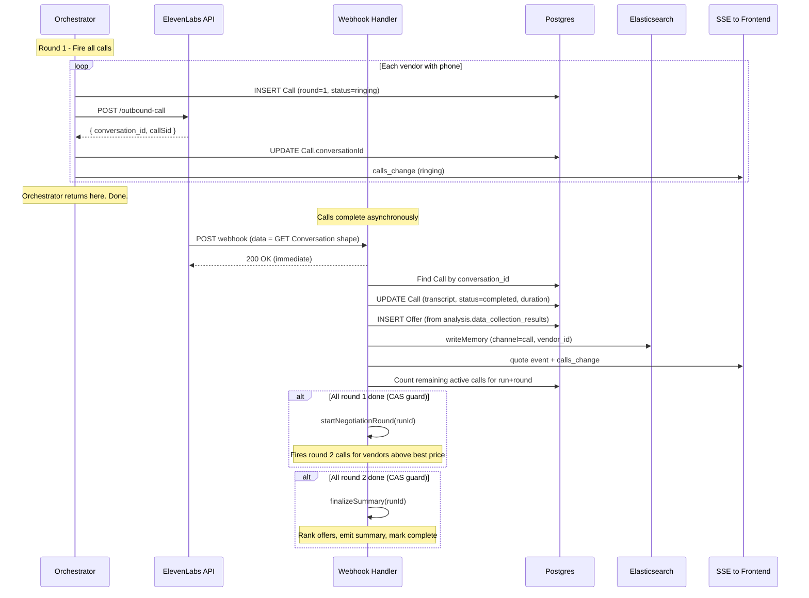

# Voice Call Pipeline — Event-Driven (No Polling)

## Architecture

No poll loop. The webhook IS the continuation. Each time ElevenLabs finishes a call, its webhook fires and drives the pipeline forward:



---

## File 1: [src/lib/elevenlabs.ts](src/lib/elevenlabs.ts) (new)

ElevenLabs voice client. One main export: `triggerOutboundCall`.

**Endpoint**: `POST https://api.elevenlabs.io/v1/convai/twilio/outbound-call`

**Headers**: `xi-api-key: ${ELEVENLABS_API_KEY}`

**Request body** (confirmed from API docs):

```typescript
{
  agent_id: string,              // ELEVENLABS_AGENT_ID_QUOTE (round 1) or _NEGOTIATE (round 2)
  agent_phone_number_id: string, // ELEVENLABS_PHONE_NUMBER_ID
  to_number: string,             // vendor phone, E.164 format
  conversation_initiation_client_data: {
    dynamic_variables: {
      // Every OutreachContext field — each becomes {{fieldName}} in agent prompt
      vendorName: "Acme Corp",
      item: "steel bolts M8x50",
      quantity: "10000",
      // ... all 14 OutreachContext fields
    },
    overrides: {
      agent: {
        first_message: "Hi, I'm calling about bulk pricing for {{item}}. Am I speaking with someone at {{vendorName}}?"
      }
    }
  }
}
```

**Response** (confirmed from API docs):

```typescript
{
  success: boolean,
  message: string,
  conversation_id: string | null,  // null = call failed to initiate
  callSid: string                  // Twilio Call SID for debugging
}
```

**Important**: `conversation_id` can be `null` if the call fails to connect. Handle this by marking the Call row as `"failed"` immediately and not waiting for a webhook.

**Env vars**: `ELEVENLABS_API_KEY`, `ELEVENLABS_AGENT_ID_QUOTE`, `ELEVENLABS_AGENT_ID_NEGOTIATE`, `ELEVENLABS_PHONE_NUMBER_ID`

---

## File 2: [src/app/api/webhooks/elevenlabs/route.ts](src/app/api/webhooks/elevenlabs/route.ts) (new)

POST handler. Return 200 immediately, process async via `void processWebhook(body)`.

**Webhook payload shape** (confirmed — matches GET Conversation response):

```typescript
{
  agent_id: string,
  status: "done" | "failed",      // only these two arrive as webhooks
  conversation_id: string,
  transcript: [
    { role: "user" | "agent", time_in_call_secs: number, message: string }
  ],
  metadata: {
    call_duration_secs: number,
    start_time_unix_secs: number,
    // ... 24 more fields we don't need
  },
  analysis: {
    data_collection_results: Record<string, string>,  // configured in dashboard
    // ... 6 more fields
  },
  conversation_initiation_client_data: { ... }  // echoed back
}
```

**Processing steps**:

1. **Look up Call** by `conversation_id` — `prisma.call.findUnique({ where: { conversationId } })`. If not found, log and return (stale/unknown call).

2. **Format transcript** — join the transcript array into readable text:
   ```
   Agent: Hi, I'm calling about...
   User: Yes, we can do $4.50 per unit...
   Agent: What about lead time?
   ```


Save to `Call.transcript`, set `Call.status = "completed"`, set `Call.duration = metadata.call_duration_secs`.

3. **Create Offer** from `analysis.data_collection_results`:

   - Map dashboard-configured fields → Offer columns: `unitPrice`, `moq`, `leadTimeDays`, `shipping`, `terms`
   - Set `confidence` based on how many fields were extracted (e.g., 5/5 = 100, 3/5 = 60)
   - Set `source: "voice-call"`, `rawEvidence` = first 500 chars of transcript
   - If `status === "failed"` or no data extracted, skip Offer creation

4. **Index to ES** — `writeMemory({ text: formattedTranscript, run_id: call.runId, vendor_id: call.vendorId, channel: 'call' })`

5. **Emit SSE events**:

   - `quote` event → `{ supplier: vendor.name, unitPrice: "$4.50", moq: "1000", leadTime: "14 days", shipping: "FOB", terms: "Net 30", confidence: 80, source: "voice-call" }`
   - `calls_change` event → re-query all Call rows for this runId, join with Vendor for names, map to: `[{ id, supplier, status: "ended", duration }]`
   - `activity` event → "Call completed with {vendorName}: got quote for ${unitPrice}/unit"

6. **Check if round is complete** — count Call rows for `runId` + `round` where status is NOT `completed` and NOT `failed`. If 0:

   - Round 1 → `startNegotiationRound(runId)` (CAS guard on Run.status)
   - Round 2 → `finalizeSummary(runId)` (CAS guard on Run.status)

---

## File 3: Orchestrator call loop — [src/lib/orchestrator.ts](src/lib/orchestrator.ts) lines 244-261

Replace the TODO block. The orchestrator fires all calls then returns — no waiting.

```typescript
// For each vendor with phone:
for (const vendor of vendorsWithPhone) {
  try {
    const context = await assembleOutreachContext(runId, vendor.id);
    const agentId = process.env.ELEVENLABS_AGENT_ID_QUOTE!;
    const result = await triggerOutboundCall(vendor.phone!, agentId, context);

    if (result.conversationId) {
      await prisma.call.create({
        data: {
          vendorId: vendor.id,
          runId,
          round: 1,
          conversationId: result.conversationId,
          status: 'ringing',
        },
      });
    } else {
      // conversation_id was null — call failed to initiate
      await prisma.call.create({
        data: { vendorId: vendor.id, runId, round: 1, status: 'failed' },
      });
    }

    // Emit calls_change with current state
    const allCalls = await prisma.call.findMany({
      where: { runId },
      include: { vendor: { select: { name: true } } },
    });
    emitRunEvent(runId, {
      type: 'calls_change',
      payload: allCalls.map(c => ({
        id: c.id,
        supplier: c.vendor.name,
        status: c.status === 'ringing' ? 'ringing' : c.status === 'completed' ? 'ended' : c.status,
        duration: c.duration ?? 0,
      })),
    });
  } catch (err) {
    console.error(`[ORCHESTRATOR] Failed to call ${vendor.name}:`, err);
  }
}

await prisma.run.update({ where: { id: runId }, data: { status: 'calling_round_1' } });
// Orchestrator returns — webhook takes over from here
```

Also update the `emitRunEvent` for `callPlanId` to show "N calls initiated" with done status. Remove the old "Awaiting ElevenLabs integration" message.

Remove the premature `stage_change: complete` and `discovery_complete` status at the bottom — the run stays in `calling_round_1` until all webhooks fire.

---

## File 4: Round 2 + Summary helpers — add to [src/lib/orchestrator.ts](src/lib/orchestrator.ts)

Two new exported async functions the webhook calls:

### `startNegotiationRound(runId: string)`

Called by webhook when all round 1 calls are done.

- CAS guard: `prisma.run.updateMany({ where: { id: runId, status: 'calling_round_1' }, data: { status: 'negotiating' } })` — if count === 0, return (another webhook already triggered this)
- Load all round 1 Offers with vendor info, find the best (lowest) unitPrice
- For each vendor whose quote is **above** best price and has a phone number:
  - `assembleOutreachContext(runId, vendor.id)` — `bestPrice`, `bestSupplier`, `targetPrice` will now auto-populate from existing offers
  - `triggerOutboundCall(vendor.phone, AGENT_ID_NEGOTIATE, context)` — uses negotiate agent with different prompt
  - INSERT Call row with `round: 2`
  - Emit SSE: `calls_change`, activity ("Negotiating with {vendorName} — current best is ${bestPrice} from {bestSupplier}")
- If no vendors need negotiation (only 1 quote, or all at same price), skip to `finalizeSummary(runId)`
- Update `Run.status = 'calling_round_2'`
- Emit `stage_change: negotiating`

### `finalizeSummary(runId: string)`

Called by webhook when all round 2 calls are done (or directly from `startNegotiationRound` if negotiation was skipped).

- CAS guard on run status → `'summarizing'`
- Load ALL Offers (both rounds) with vendor info
- Take the best (lowest unitPrice) offer per vendor (round 2 supersedes round 1)
- Rank by unitPrice ascending
- Compute:
  - `bestPrice`: lowest unit price formatted as string
  - `bestSupplier`: vendor name with best price
  - `savings`: difference between highest and lowest quote, formatted as percentage
  - `avgLeadTime`: average of leadTimeDays across offers
  - `quotesReceived`: count of offers
  - `suppliersFound`: count of all vendors in run (not just those with offers)
  - `recommendation`: "Recommend {bestSupplier} at {bestPrice}/unit with {leadTime} day lead time. {savings}% below highest quote."
  - `nextSteps`: ["Place purchase order with {bestSupplier}", "Request sample shipment for quality verification", "Set up recurring order schedule"]
- Emit SSE:
  - `summary` event matching [summary-panel.jsx](src/components/summary-panel.jsx) shape
  - `stage_change: complete`
  - `services_change`: all false
- Update `Run.status = 'complete'`

---

## Race Condition Guard

Multiple webhook POSTs can arrive near-simultaneously. Use compare-and-swap on `Run.status`:

```typescript
// Only proceeds if status matches expected — atomic
const advanced = await prisma.run.updateMany({
  where: { id: runId, status: 'calling_round_1' },
  data: { status: 'negotiating' },
});
if (advanced.count === 0) return; // another webhook already handled it
```

Same pattern for `calling_round_2` → `summarizing` → `complete`.

---

## Improvements from API docs review

1. **`first_message` override** — Customize the opening line per vendor via `conversation_initiation_client_data.overrides.agent.first_message`. Makes the call feel natural: "Hi, I'm calling about bulk pricing `for {item}. Am I speaking with someone at {vendorName}?" Round 2 gets a different opener: "Hi, I spoke with someone earlier about {item}. I have a competing quote at {bestPrice} and wanted to see if you could match that."

2. **Handle `conversation_id: null`** — The outbound-call response can return `conversation_id: null` if the call fails to initiate. The code must handle this by marking the Call as `failed` immediately instead of waiting for a webhook that will never come.

3. **Transcript formatting** — The webhook returns transcript as an array of `{ role: "user"|"agent", time_in_call_secs: number, message: string }`. Format into readable `"Agent: ...\nUser: ...\n..."` for storage and ES indexing.

4. **Duration from metadata** — Use `metadata.call_duration_secs` (integer seconds) directly for `Call.duration`. No need to compute it ourselves.

5. **Confidence scoring** — Derive the quote confidence percentage from how many fields `data_collection_results` successfully extracted (5 fields configured: unit_price, moq, lead_time, shipping, terms → each field present = +20%).

6. **Add `location` to OutreachContext** — Already in `parsedSpec` but not being passed. Add it so the agent can reference the delivery location when asking about shipping costs. Update the OutreachContext interface to include `location: string`.